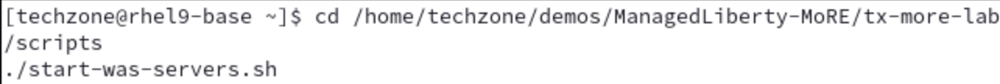

# IBM Application Modernization Accelerator (AMA) Lab

**  

**Document edition: June 2025**

## Table of Contents

[Introduction 1](#introduction)

[About this lab 3](#about-this-lab)

[Steps for the lab tasks 4](#steps-for-the-lab-tasks)

## Introduction

Application Modernization Accelerator is a modernization tool designed
to scan and discover your entire Java application estate. The
applications are scanned in place to allow for the collection of their
configuration so that a detailed picture of the connections between
applications, database and queues can be discovered.

Analysis is provided to identify the challenges in going to a list of
different runtime destinations and common code across the estate is
identified to ensure the work of modernization is only done once, and
not multiple times. Guidance is provided on how to build modernization
momentum by concentrating on the applications that share common code, so
code changes help to modernize as many applications as possible as
quickly as possible.

The analysis and configuration collected during the scan is then used to
generated migration artifacts that are customized for each application
to accelerate the modernization of the application to the desired
runtime destination.

The estate wide view of all stages of the process, from scanning, to
analysis to modernization implementation allows for accurate planning,
risk assessment and evaluation of the return-on-investment for each
potential destination.

Application Modernization Accelerator developer tools are designed to
run on your application source code and modernize both the Java runtime
and the Java version

Java runtime modernization allows you to analyse your legacy enterprise
Java application and modernize it to use a more lightweight, flexible,
and efficient runtime. Receive a prescriptive plan that describes the
changes that are needed to modernize your application with a detailed
assessment of complexity and required development effort. Use automation
to quickly implement code and configuration changes.

Java version modernization allows you to identify changes required to
upgrade Java code and automatically update the relevant application
code. Receive a prescriptive plan that describes the changes that are
needed to upgrade your application with a detailed assessment of
complexity and required development effort. Use automation to quickly
implement code changes.

## About this lab

The main objective of this hands-on lab is to present an end-to-end
overview of the capabilities of IBM Application Modernization
Accelerator (AMA) and to explicitly show how the AMA developer tools can
quickly and easily modernize Java applications.

Modernization is a complex area with many conflicting requirements. In
essence the goal is always to modernize as much as possible as quickly
as possible, but in practice modernization is “One size fits none.”
There is rarely any return on investment to modernize all applications
to the very latest technologies and architectures. AMA is designed to
allow you to develop a strategy that best suits your business needs and
then to accelerate its implementation.

AMA is designed to accelerate the modernization of your whole Java
estate. In this lab you take on the role of the modernization architect
who has been tasked with modernizing **InstantPayments**, an aging
application infrastructure. While the whole estate needs to be
modernized there is one critical business application that has been
identified as needing to be modernized first. The business application
is **WhereAmI** (version 2.0.0), which is a Java 8 application running
on a traditional WebSphere Application Server (tWAS). Your objective is
to modernize this application and move it to a modern runtime
environment, IBM Modernized Runtime Extension for Java (MoRE). 

With MoRE you can:

  - Run modern applications without losing the stability, availability
    and security of the underlying operational infrastructure of tWAS

  - Realize faster time to value with modernization and migration tools
    to support application transitions and improvements for current
    estate

  - Improve consistency, efficiency, and collaboration while
    accelerating new app development between Operations teams
    and developers

You are going to use AMA to evaluate this application, to modify its
code automatically and to prepare the migration package for moving from
tWAS to MoRE.

In this lab, you are going to perform the following tasks:

1.  Review the **WhereAmI** application deployed in the tWAS
    environment.

2.  Install AMA local version.

3.  Get familiar with AMA functions and capabilities.

4.  Use AMA to analyse the **WhereAmI** application for the targeted
    MoRE environment, to create the migration bundle.

5.  Use AMA Dev Tools to modify the code and make suggested changes.

# Steps for the lab tasks

1.  Review the **WhereAmI** application in the tWAS environment.

    The **WhereAmI** (version 2.0.0) application has been deployed to the
tWAS environment, you are going to use the following steps to review
it and get familiar with the tWAS environment.

    a. Click the **terminal** **icon (A)** to open a **terminal** window.

    

    b. Start the WebSphere Deployment Manager, WebSphere ND Node Agents
     and IBM HTTP Server (IHS) by issuing the commands below:
    
        cd /home/techzone/demos/ManagedLiberty-MoRE/tx-more-lab/scripts
    
        ./start-was-servers.sh
    
    
    
    The WAS ND Manager, WAS Node Agents and IHS server are started.
    
    

    c.  Access the WebSphere Integrated Solution Console (WAS Admin
     Console). Open a web browser window by clicking **Activities (A)**
     and clicking the **Firefox icon (B)**.

    
 
    

    d.  In the Firefox window, navigate to the WebSphere Integrated
     Solutions Console (WAS Admin Console) with URL:
     
         https://localhost:9043/ibm/console   (A)

    
 
    >**Note:** If you see the message “Warning: Potential Security Risk
 Ahead..”, click **Advanced…** then click **Accept the Risk and
 Continue**.

    e. Accept the default user ID and Password and click **Log in (A)**.

    

    > **Note:** the log in credentials are User ID: **techzone** Password:
**IBMDem0s\!**

    f. If you see the following screen, select the **Long out option
    (A)** and click **OK (B)**.

    

    g.   Start the tWAS cluster named **tWASCluster1** by selecting
     **Servers (A)** -\> **Clusters (B)** -\> **WebSphere application
     server clusters (C)**, checking the **box next the tWASCluster1
     (D)** and clicking **Start (E)**.

    
 
    After the **tWASCluster1** gets started, the **WhereAmI** application
 can be accessed through the default IHS port 8080.

    h.  Access the **WhereAmI** application from the IHS URL:
     
        http://localhost:8080/tWAS/WhereAmI**
      
    The WhereAmI application page is displayed.

    
 
    This is a simple application that provides information about which
 WebSphere server the application is running.

    i. Click the **page refresh button (A)** a few times, you can see
     that the displayed information changes between **tWASMember1** and
     **tWASMember2**, which are the two tWAS members of the
     **tWASCluster1** cluster.

    

2.  Install IBM Application Modernization Accelerator (AMA) local
    version.

    In this section, you are going to learn to process to install AMA
 local version (4.3.0), which is already downloaded to the lab VM.

    a. In the **terminal** window issue the following commands to AMA
     local installation utility.
 
        cd /home/techzone/AMA-local-4.3.0
       
        ./launch.sh
 
       

    b. Type **1** and press **Enter (A)**.

    

    c. Type **1** and press **Enter (A)** to accept the license
     agreement.

    

    d. Type **1** and press **Enter (A)** to start the installation
     process.

    
 
    The installation process takes a few minutes to complete. After it is
 done, it shows that the AMA can be access through its URL. In the
 following screenshot, the URL is: **https://rhel9-base.gym.lan:443.**
 
    > Note: The AMA URL maybe different in your lab environment.
 
    

    e. Right clicking the **AMA URL (A)** and select **Open Link (B)**.

    
 
    This launches the AMA page in the Firefox web browser window.
 
     > Note: If you see the message “Warning: Potential Security Risk
 Ahead..”, click **Advanced…** then click **Accept the Risk and
 Continue**.

    f. In the AMA web page, click **Skip (A)**.

    
 
    Now you can see the AMA web page.
 
    

3.  Create AMA Workspace.

    To use AMA, you need to create an AMA **Workspace** first, which is a
 designated area that houses the migration recommendations provided by
 AMA against Java application server environment. 
 
     In AMA home page, you
 use **Create workspace** button to create a new Workspace. In this
 lab, you are going to create a Workspace called **TX2025**.

    a. Click **Create workspace (A)**.

    

    b. Enter the Workspace name as **TX2025 (A**) and click **Create
     (B)**.

    
 
    The TX2025 workspace is created.
 
    
 
    As you can see in the AMA Workspace page, two utilities, 
    **Discovery Tool** and **Data Uploader**, are listed. 
    
    - AMA offers the Discovery
 Tool utility for getting the application data from the Java
 application server running in client’s environment. This Java utility
 can be downloaded from the AMA Workspace page. 
 
    - You can download and
 run this utility against your Java application server to collect all
 application data on the server. 
 
    - The utility can send the collected
 data directly back to AMA, if AMA is in the same network as the
 application server. 
 
    - It also saves the collected data in a zip file
 which can be uploaded to a remote AMA using the Data Uploader utility.

4.  Download and install AMA Discovery Tool.

    After the AMA Workspace is created, you have options to either
 `download` the Discovery Tool utility or `upload` existing data file.
 
    In this lab, you learn how to download and install the Discovery Tool
 utility. 
 
    First, you go to the `Discovery Tool` page and download
 different version of the utility based on your application server
 operating system. The Discovery Tool page also shows the information
 on how to use the utility in command line to collect application data
 from WebSphere, WebLogic and Tomcat servers.
 
    Next, you save the downloaded utility in your local workstation. This
 result is a file with a name like
 `**DiscoveryTool-Linux\_\<WORKSPACE\_NAME\>.tgz**` being downloaded and
 stored in your workstation **Downloads** directory.
 
    To use the Discovery Tool, you need to extract the Discovery Tool tgz
 file using the information in the Discovery Tool documentation page.
 
    The extracting command unpacks the tgz file and save all Discovery
 Tool files in a `**transformationadvisor-\<VERSION\>**` directory.

    a. Click **Open discovery tool (A)**.

    
 
    The Discovery tool page is displayed.
 
    
 
    Here you can download the utility based your application server
 operating system. It also provide information on how the Discovery
 tool works and a documentation link.

    b. Click **Download discovery tool (A)** to download the Linux
     version of Discovery tool, because the lab VM is the Linux
     operating system.

    
 
    > Note: If you see the message “Warning: Potential Security Risk
 Ahead..”, click **Advanced…** then click **Accept the Risk and
 Continue**.
 
    The Discovery tool file named `DiscoveryTool-Linux_TX2025.tgz` is
 downloaded to the **/home/techzone/Downloads** directory.
 
    

    c. After the Discovery tool is downloaded, click **Go back icon (A)**
     two times to get back to the AMA Discovery tool page

    

    d. In the Discovery tool page, right-click **documentation (A)** and
     select **Open Link in New Tab (B)**.

    

    e. In the documentation page, **scroll down (A)** to the **Installing
     the discovery tool** section to learn the commands used to install
     the utility.

    

    f. From the terminal window, issue the following commands to install
     the utility.

        cd /home/techzone/Downloads
 
        tar xvfz DiscoveryTool-Linux\_TX2025.tgz
 
    This extracts the AMA Discovery Tool utility to the
 `/home/techzone/Downloads/transformationadvisor-4.3.0` directory.
 
    Now the AMA Discovery Tool is installed, you can run it against your
 application server. The AMA Discovery Tool documentation page provides
 detail information on how to run the tool.
 
    The tool can collect data from different application server runtimes,
 including WebSphere, WebLogic, JBoss, Tomcat and DB2. 
 
    It also can
 narrow the analysis scope at different levels, either on application
 and configuration, or on application only or on ear/war files.

5.  Using the AMA Discovery Tool against the tWAS cell via command:

        cd /home/techzone/Downloads
 
        transformationadvisor-4.3.0/bin/transformationadvisor -w  /home/techzone/IBM/WebSphere/AppServer/

    a. Type **1** and press **Enter (A)**.

    
 
    The discovery tool will start to scan the WebSphere environment.
 
    
 
    Wait until the collection has been uploaded and is available in AMA.

6.  Evaluate the **WhereAmI** application with AMA.

    After the Data Collector results have been uploaded to AMA, a set of
 recommendations are created, you can go through to check them out.

    a. In the AMA Discovery Tool page, click the workspace **TX2025 (A)**
     to go back to the workspace page.

    
 
    You can see that the data collected by the AMA Discovery Tool is now
 uploaded to AMA Workspace page.
 
    
 
    You can see that the **WhereAmI** application version `2.0.0` is showing
 in the **Visualization** tab and there are no dependencies to other
 applications, databases or queues.

    b. Click **Minimize icon (A)** to minimize the Context window.

    

    c. Click **Assessment tab (A)**.

    

    d. Select the **Target destination** as **Liberty administered from
     WebSphere (MoRE) (A)**.

    
 
    As you can see, the application can be migrated to MoRE but there are
 some issues that must be fixed.

    e.  Click **WhereAmI application (A)** in the Java applications list
     to get more insight about its issues.

    
 
    The **WhereAmI** application analysis details page is displayed.
 
    
 
    You can see that:
 
    - The target environment is **MoRE**, and the source environment is
 **IBM WAS ND**. 
    - The application is marked with a Complexity of
 **Moderate** and with Code changes **Part-automated**. 
    - The Complexity
 score section shows that there three **Critical** issues and three
 **Information** issues. 
    - Issues are marked as **Critical** indicate
 that code changes need to be done before the application can run on
 **Liberty administered from WebSphere (MoRE)**. 
    - Issues marked as
 Informational indicate that the code is expected to work, but might
 behave in unexpected ways, so it is recommend to look at these issues
 if problems are found during testing.
 
    - The **Part-automated** code change means that these codes changes are
 partially automated and some manual code changes are needed.
 
    - The estimated effort to move the application to **MoRE** is `1.5 days.`

    f. Expand the **issue sections (A)**, you can see that the three
     critical issues requires application code changes.

    

    g. Click **Getting the server name on Liberty link (A)** to review
     the first critical issue.

    
 
    The issue detail is summarized and **Issue help** provides
 recommendations on how to address the issue.
 
    

    h. On the left-hand side click **Required code changes** **(A)**.

    
 
    The screen scrolls to the Required code change section and you can see
 how to access the necessary recipes to apply the required code change
 automatically.
 
    

    i. AMA creates three reports that provides more analysis results. Click **Inventory report (A)** to review it
     in a different browser window.
    - **Inventory report**
    - **Technology report**
    - **Analysis report**

    
 
    The **Inventory report** lists high-level inventory of the content and
 structure of each application, plus information about potential
 deployment problems and performance considerations.
 
    

    j. Click **Technology report (A)** to review it in a different
     browser window.

    
 
    The Technology report provides details on which IBM platforms support
 the technologies used by the applications.
 
    

    k. Click **Analysis report (A)** to review it in a different browser
     window.

    
 
    The Analysis report shows potential issues, their severity and
 possible solutions.
 
    

    l. Click **View migration plan (A)**.

    

    m. Click **Download (A)** to generate and download the migration plan
     so that you can re-use it in AMA Dev Tools.

    
 
    The AMA Migration Plan is now downloaded to the **Downloads**
 directory.

7.  Use the AMA Dev Tools to apply fixes.
    
    a.  In a terminal window, switch to the **WhereAmI** version 2.0.0
         directory and open VS Code with commands:

        cd /home/techzone/demos/AMA/WhereAmI-2.0.0-Project/WhereAmI
 
        code .

    b.  In VS Code page, if you see the following Authentication required
     window, enter the password as: **`IBMDemo0s!`** and click **Unlock
     (A)**.

    
 
    If a pop-up asks if you trust the authors of the files, click on
 **`Yes, I trust the authors`**.
 
    
 
    The VS Code editor window is displayed.
 
    

    c. Cancel any **Install or update windows (A)**.

    

    d. Edit the **`WhereAmI`** applications **`pom.xml`** 
    
    - Change the application version from **`2.0.0`** to **`2.0.1`** by clicking
     **WHERAMI (A)**-\>**pom.xml (B)** and changing the version value
     to **2.0.1 (C)**.

    

    e. `Save` the change of **pom.xml** by pressing **Ctrl+S**, then `close`
     the pom.xml file.

    f.  Right-click **src(A)** under **WHEREAMI** and select **Modernize
     Java Applications -\> Modernize to Liberty (B)**.

    

    g.  Next click **Upload migration plan (A)** to upload the AMA
     generated migration plan into AMA Dev Tools.

    

    h.  Navigate to the **/home/techzone/Downloads** directory, select the
     **AMA Migration Plan file (A)** and click **Open (B)**.

    

    i. Make sure that the **box next to server.xml is checked (A)** and
     click **Proceed (B)**.

    

    j.  Review the identified modernization issues of the application,
     which are going to be automated fixes by AMA Dev Tools, and click
     **Run automated fixes (A)**.

    

    k. Click **Rebuild and refresh (A)**.

    
 
    You can see that all issues have been resolved.
 
    
 
    As a result, AMA Dev Tools creates a new version **WhereAmI** (2.0.1)
 of the application in the **target** directory.
 
    
 
    Now the new version of **WhereAmI** application is ready to be
 deployed to the **MoRE** environment.

8.  Stop WebSphere servers.
    
    a.   Now you have completed all AMA lab tasks, you need stop the
         WebSphere Deployment Manager, WebSphere ND Node Agents and IBM
         HTTP Server (IHS) by issuing the commands below:
        
        cd /home/techzone/demos/ManagedLiberty-MoRE/tx-more-lab/scripts
        
        ./stop-was-servers.sh

## Summary

In this lab, you learned how to evaluate the existing Java application
using IBM Application Modernization Accelerator (AMA) and migrate it to
the new Java runtime environment (in this case MoRE).

The intention of this application modernization exercise is to move an
old Java application, **WhereAmI,** from traditional WebSphere V905
environment to IBM Modernized Runtime Extension for Java (MoRE)
environment with minimal code changes.

AMA was used to analyze the application for compatibility with
traditional WebSphere and determined that code changes can be made
part-automated to speed up the modernization process. AMA Dev Tools with
VS Code was used to modify the application code and to migrate it to the
Java runtime environment.

The lab demonstrates that IBM AMA can help to accelerate the application
modernization process, minimize errors and risks and reduce time to
market.

